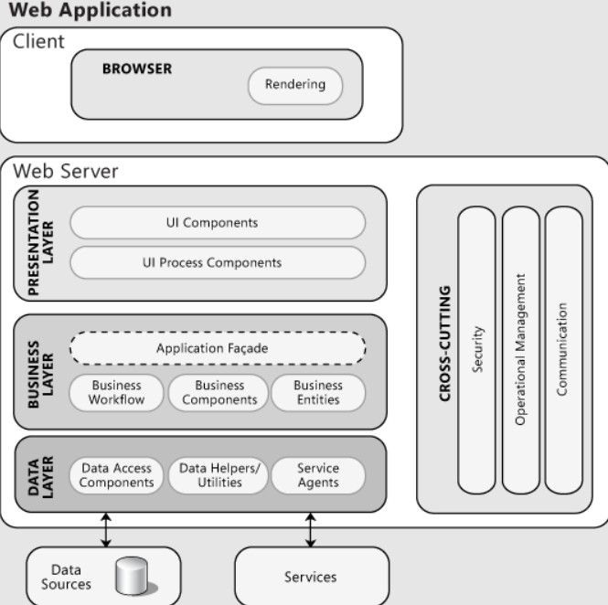
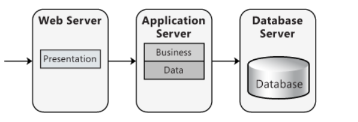

# ADD - Iteration 1

## Step 1: Considered Inputs

System type: Greenfield in mature domain   

| Driver type        | Description                                                              |
| ------------------ |--------------------------------------------------------------------------|
| Constraints        |           |
|         | CON-01: The project must be accessible via web browser.                  |
|                    | CON-03:  Application must use Spring.                                    |
|                    | CON-04:  Application must use Postgress as Database.                     |
|                    | CON-05:  Mockups should be aproved for the team.                         |
| Quality Attributes |               |
| | QA-02:  Secure by design principles should be adopted                    |
|   | QA-03: SQL Injection should be taken into account when querying database |
| UC                 |                                                                          |
| 	 | UC-01: Developers can CRUD Tag  	                                        |   	|
| 	 | UC-02: Developers can CRUD Issue                                         |   	|
|  | UC-03: Developers can CRUD Post	                                         |   	|
| 	 | UC-04: SystemAdmin can CRUD User	                                        |   	|
| Concerns           |                                                                       |
|  | CRN-03: All features must be tested                                      |
|  | CRN-04: Establish a system architecture to implement                     |
## Step 2: Iteration Goal

- Iteration 1 goal is to structure the system;
- Greenfield: First goal should be to create a structure for the system by defining design concepts such as reference architectures, deployment patterns and externally developed components.

## Step 3: Elements to decompose/refine

- Taking into account this iteration goal, the element to refine and decompose is the system as a whole.

## Step 4: Design Concepts

### Reference architectures

(https://docs.microsoft.com/en-us/previous-versions/msp-n-p/ee658099(v=pandp.10))

### Deployment patterns 

(https://docs.microsoft.com/en-us/previous-versions/msp-n-p/images/ee658099.d7efd0e6-fc6f-4d49-b6f1-225decd0afd9(en-us,pandp.10).png)

## Step 5: Instantiate architectural elements, allocate responsibilities and define interfaces

- Presentation Layer: Display the UI and facilitate user interaction. What the user will see from the application.
- Service Layer: Middleware between Presentation and Business layer. This allows to keep the business layer intact when exposing application functionality. No business rules should be included here.
- Business Layer: Application core where all the business logic and workflows are implemented. Should not be exposed to the application exterior domain, only when accessed by service layer.
- Data Layer: Data layer to abstract the business layer of the all data logic and management.

## Step 6: Sketch views and record design decisions

### Component View

The component diagram is represented in the image below

TODO

### Deployment View
The component diagram is represented in the image below

TODO

## Sequence Diagram

In the image below we can see an example of the architeture we will use in this projet represented by this diagram, which refers to UC2

TODO

## Step 7: Perform analysis of current design and review iteration goal and design objectives

### Updated Kanban board

https://github.com/CaioSanches143/IssueSys/projects/1