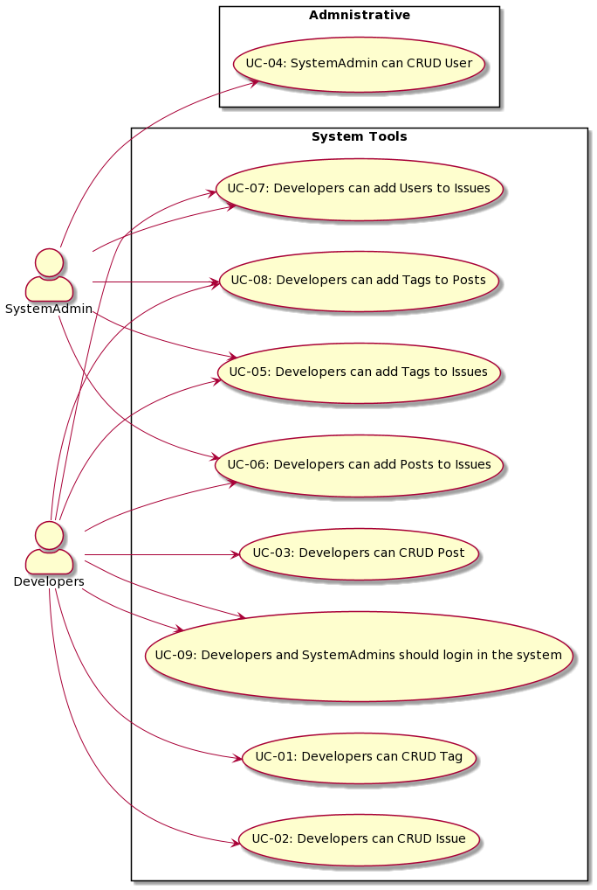

# ADD

## Architectural drivers

### Type of system: 

- Greenfield in mature domain - New application/solution in a well-know domain;

### Constraints: 

TODO Add constraint regarding team members time

| ID     | Constraint                                            | Description |
|--------|-------------------------------------------------------| ----------- |
| CON-01 | The project must be accessible via web browser        |             |
| CON-02 | Only "open-source" tools and technologies are allowed |             |
| CON-03 | Application must use Spring                           |             |
| C0N-04 | Application must use Postgress as Database            |             |
| C0N-05 | Mockups should be created and aproved by the team     |             |

### Quality attributes:
    
| ID    | Quality attribute | Scenario | Associated use case | Priority |
|-------| ----------------- | -------- | ------------------- | -------- |
| QA-01 | Security | Authentication and Authorization are required for the project | All | (H,H) |
| QA-02 | Security | Secure by design principles should be adopted | All | (M,H) |
| QA-03 | Security | SQL Injection should be taken into account when querying database | All | (M,H) |

### Functional requirements:

| ID	    | Description	                                       |   Details	|
|--------|----------------------------------------------------|---	|
| UC-01	 | Developers can CRUD Tag  	                         |   	|
| UC-02	 | Developers can CRUD Issue                          |   	|
| UC-03	 | Developers can CRUD Post	                          |   	|
| UC-04	 | SystemAdmin can CRUD User	                         |   	|
| UC-05	 | Developers can add Tags to Issues	                 |   	|
| UC-06	 | Developers can add Posts to Issues                 |   	|
| UC-07	 | Developers can add Users to Issues                 |   	|
| UC-08	 |Developers can add Tags to Posts                    |   	|
| UC-09	 | Developers and SystemAdmins should login in the system |   	|

### UC diagram

- Developers: Users of the system.
- SystemAdmin: administrate the system, as the users.

### Architectural Concerns:

| ID	    | Description	                                                                                                                                 |
|--------|----------------------------------------------------------------------------------------------------------------------------------------------|
| CRN-01 | Exceptions should be saved to a ".log" file.                                                                                                 |
| CRN-02 | Authentication and authorization is required                                                                                                 |
| CRN-03 | All features must be tested                                                                                                                  |
| CRN-04 | Establish a system architecture to implement                                                                                                 |
                                                                            

